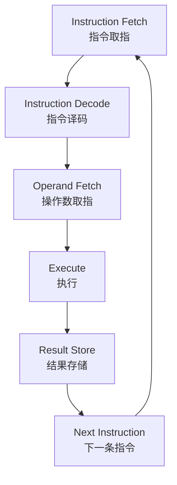

## 指令格式

### 指令系统概述

机器指令要素：

- 操作码
- 源操作数地址
- 目的操作数地址
- 下一条指令地址

指令类型：

- 数据传输指令
- 算数/逻辑运算指令
- 程序控制指令
- 其他

操作数的类型

- 数值（无符号、定点、浮点）
- 逻辑型数、字符
- 地址（操作数地址、指令地址）

操作数的位置

- 存储器（存储器地址）
- 寄存器（寄存器地址）
- 输入输出端口（输入输出端口地址）

操作数的存储方式

- 大端（big-endian）次序：**最高有效字节**存储在地址**最小位置**
- 小端（little-endian）次序：**最低有效字节**存储在地址**最小位置**

#### 指令集系统结构(ISA)
种类：

- Register-Memory式（如x86）
  - 多种指令可以访问内存；
  - 存在寄存器操作数和内存操作数直接运行的指令；
- Register-Register式（如MIPS）
  - 只有装载（LOAD）和存储（STORE）指令可以访问内存
  - 运算指令操作数全部为寄存器操作数；

#### 通用寄存器优势

- 寄存器比存储器快
- 寄存器便于编译器使用
- 寄存器可以保存变量
- 减少存储器访问，提高速度
- 提高代码密度，寄存器地址比存储器地址短

### 指令格式

#### 机器指令

格式：操作码 ＋ 操作数（操作数地址）

操作数地址数目：

- **三地址**：`Des ← (Sur1) OP (Sur2)`
  
  | OP  | Des Add | Sur1 Add | Sur2 Add |
  | --- | ------- | -------- | -------- |

- **双地址**：`Des ← (Sur) OP (Des)`
  
  | OP  | Des Add | Sur Add |
  | --- | ------- | ------- |

- **单地址**：累加器作为其中一个操作数的双操作数型，或单操作数型
  
  | OP  | Add |
  | --- | --- |

- **零地址**：隐含操作数型，或无操作数型
  
  | OP  |
  | --- |

## MIPS指令系统

### MIPS指令格式

R型指令（寄存器型指令）
| opcode (6) | rs (5) | rt (5) | rd (5) | shamt (5) | funct (6) |
| ---------- | ------ | ------ | ------ | --------- | --------- |

I型指令（立即数型指令）
| opcode (6) | rs (5) | rt (5) | immediate (16) |
| ---------- | ------ | ------ | -------------- |

J型指令（跳转型指令）
| opcode (6) | address (26) |
| ---------- | ------------ |

### MIPS寻址方式

1. 立即寻址
2. 寄存器寻址
3. 基址寻址
4. PC相对寻址
5. 伪直接寻址

---

> 📎 配套实验代码：[汇编 相关实验](https://github.com/wv-ce/BUAA_CO)（含 Logisim / MIPS / Verilog 等）
