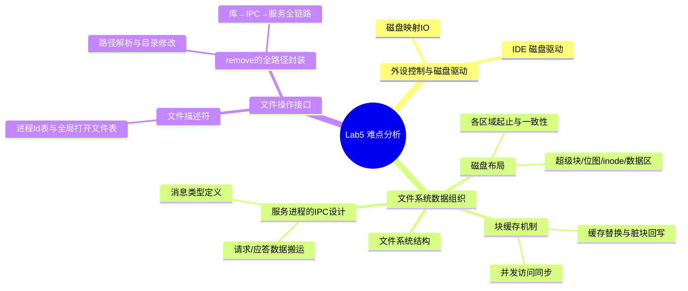
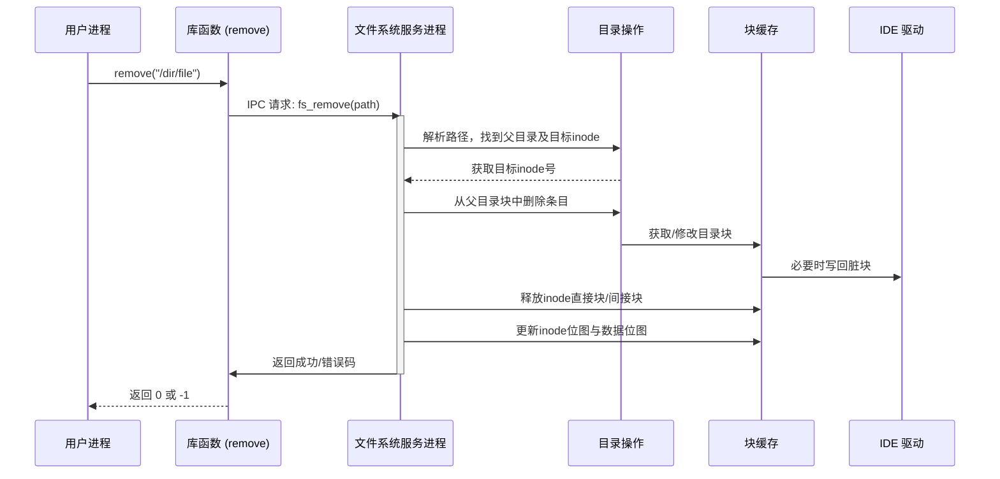

## 思考题

### Thinking 5.1

1. 会引发的主要问题：数据不一致性与 I/O 失效

* 写操作无法即时到达设备： 写入数据时，数据可能会被留在 CPU 的 Cache 中，而没有真正写入设备的寄存器或存储介质。这导致设备无法接收到控制命令或数据。
* 读操作无法反映设备状态变化： 读取设备时，CPU 可能会直接从 Cache 中获取之前的旧数据，而忽略了外部设备状态的实时更新。
* 副作用缺失： 很多设备寄存器的读写操作具有特定副作用（如清除中断标志、触发发送等），通过缓存访问会导致这些副作用无法按预期发生。

2. 不同设备的操作差异

*   串口设备（如 UART）：
    *   差异极大且致命。 串口寄存器（如发送保持寄存器、接收缓冲寄存器）是高度时效性的。如果读写被缓存，会导致无法发送字符或读到“影子”数据，且无法通过读取状态寄存器来判断设备是否就绪，整个通信链路会崩溃。
*   IDE 磁盘（大块数据传输）：
    *   相对复杂。 虽然控制寄存器部分同样严禁缓存，但在进行大块数据读写（如 DMA 传输）时，如果不正确处理缓存，会导致磁盘写回的数据与内存中的 Cache 不一致。
    *   缓存更新策略影响： 如果使用写通（Write-through），写入会同步到内存，但读取仍可能读到 Cache 旧值；如果使用写回（Write-back），则数据可能长期滞留在 Cache，必须手动执行特定的 Cache 无效化（Invalidate）或刷新（Flush）指令，这大大增加了编程复杂度且易出错。

### Thinking 5.2

1.  一个磁盘块中最多能存储多少个文件控制块？
    一个磁盘块的大小（`BLOCK_SIZE`）等同于一页的大小（`PAGE_SIZE`），为 4096 字节（4KB）。
    在 `fs.h` 中有以下相关定义：
    ```c
    #define BLOCK_SIZE PAGE_SIZE        // 4096 字节
    #define FILE_STRUCT_SIZE 256        // 文件控制块 (struct File) 结构体的大小为 256 字节
    #define FILE2BLK (BLOCK_SIZE / sizeof(struct File))   // 即 BLOCK_SIZE / FILE_STRUCT_SIZE
    ```
    其中，`sizeof(struct File)` 经过 `f_pad` 的填充字节定义，正好是固定大小的 `FILE_STRUCT_SIZE`（即 $256$ 字节）。
    则一个块内能存放的文件控制块数：
       $$\text{FILE2BLK} = \frac{\text{BLOCK\_SIZE}}{\text{FILE\_STRUCT\_SIZE}} = \frac{4096}{256} = 16$$

    一个磁盘块最多能存储 16 个 文件控制块。

2.  一个目录下最多能有多少个文件？

    在 MOS 文件系统中，目录本质上也是一个文件，其内容是由连续排列的 `struct File` 结构体（文件控制块）组成的。
    因为目录也是文件，所以限制它最多能包含多少文件的因素，是单个文件最多能占用的磁盘块数。

    我们来计算一个目录文件最多能占用多少个磁盘块（Block）：
    *   直接索引指针数：`NDIRECT = 10`
    *   间接索引指针数：`NINDIRECT = BLOCK_SIZE / 4 - 10 = 4096 / 4 - 10 = 1024 - 10 = 1014` （不使用前10个间接指针）
    *   文件占用的最大磁盘块数 = 直指块 + 间接块 = $10 + 1014 = 1024$ 块。

    那么，最大文件数 = 最大磁盘块数 $\times$ 单块内文件控制块数 = 1024 $\times$ 16 = 16384

3.  我们的文件系统支持的单个文件最大为多大？

    在 `fs.h` 中，单个文件最大大小的计算宏如下：
    ```c
    #define NINDIRECT (BLOCK_SIZE / 4)
    #define MAXFILESIZE (NINDIRECT * BLOCK_SIZE)
    ```
    文件系统支持的单个文件最大为：
    $$\text{MAXFILESIZE} = 1024 \times 4\text{KB} = 4096\text{KB} = 4\text{MB}$$

### Thinking 5.3

1GB

### Thinking 5.4

#### 1. `BLOCK_SIZE` & `BLOCK_SIZE_BIT`
```c
#define BLOCK_SIZE PAGE_SIZE
#define BLOCK_SIZE_BIT (BLOCK_SIZE * 8)
```
*   解释：`BLOCK_SIZE` 指每个“文件系统块”的大小。这里将其与操作系统的页大小绑定。`BLOCK_SIZE_BIT` 表示一个块所含的比特数（$4096 \times 8 = 32768$ 位）。
*   主要应用之处：
    *   磁盘读写的最小单元：OS 按“块”为单位在内存和磁盘之间搬运数据。
    *   空闲块管理：`BLOCK_SIZE_BIT` 用来作为位图（Bitmap）管理的基本单位。一个空闲位图块正好能管理 32768 个磁盘块的分配与回收。

#### 2. `NDIRECT` & `NINDIRECT` & `MAXFILESIZE`
```c
#define NDIRECT 10
#define NINDIRECT (BLOCK_SIZE / 4)
#define MAXFILESIZE (NINDIRECT * BLOCK_SIZE)
```
*   解释：
    *   `NDIRECT` (10)：一个 `struct File`（FCB）中包含的直接块指针数量。
    *   `NINDIRECT` (1024)：一个间接块中能存放的磁盘物理块号。
    *   `MAXFILESIZE` (4MB)：文件系统支持的单个文件最大字节数。
*   主要应用之处：
    *   文件索引与查找：在 `file_get_block()` 函数中，用于判定目标块指针在线性索引中的位置。如果所需的逻辑块号 $blk < 10$，直接走 `f_direct[blk]`；如果 $\ge 10$，则通过间接地址 `f_indirect` 指向的索引页去查找。
    *   边界保护：在 `file_set_size()` 等写操作中，用于限制文件大小不超过 `MAXFILESIZE`。

#### 3. `FILE_STRUCT_SIZE` & `FILE2BLK`
```c
#define FILE_STRUCT_SIZE 256
#define FILE2BLK (BLOCK_SIZE / sizeof(struct File))
```
*   解释：
    *   `FILE_STRUCT_SIZE` 强制规定一个 `struct File` 的磁盘存储实体为固定的 256 字节。
    *   `FILE2BLK` 为一个标准磁盘块中能够紧密塞入的文件控制块数量（16个）。
*   主要应用之处：
    *   目录项遍历：因为目录本身也是一个文件，当你在某个目录下查找、创建或删除文件时，需要在一页中按 `FILE2BLK` 步长遍历文件控制块，以匹配文件名。

#### 4. `SECT_SIZE` & `SECT2BLK`
```c
#define SECT_SIZE 512
#define SECT2BLK (BLOCK_SIZE / SECT_SIZE)
```
*   解释：
    *   `SECT_SIZE` 代表磁盘物理扇区的大小。
    *   `SECT2BLK` 代表一个文件系统逻辑块含有的物理扇区数量（$4096 / 512 = 8$ 扇区）。
*   主要应用之处：
    *   IDE 硬件驱动控制：磁盘驱动（如 `ide_read`、`ide_write`）是以扇区为单位向硬件发送控制器指令的。当系统需要读写一个逻辑块（Block）时，需要利用 `SECT2BLK`（即通过逻辑块号乘上 `SECT2BLK` 计算出对应的物理扇区号）向 IDE 磁盘发送读写 8 个扇区的指令。

#### 5. `DISKMAP` & `DISKMAX`
```c
#define DISKMAP 0x10000000
#define DISKMAX 0x40000000
```
*   解释：
    *   `DISKMAP` 定义了文件系统服务进程（FS Server）虚拟地址空间中外设磁盘块映射的起始虚拟地址（`0x10000000`）。
    *   `DISKMAX` 代表系统支持的最大磁盘大小（1GB，即 `0x40000000`）。
*   主要应用之处：
    *   磁盘块缓存（Block Cache）：MOS 将磁盘块 `n` 直接映射到 FS 进程的虚拟内存空间 `DISKMAP + n * BLOCK_SIZE`。

### Thinking 5.5

`fork` 前后的父子进程会共享文件描述符和定位指针（Offset）。

```c
#include <lib.h>

void umain(int argc, char argv) {
    int r;
    int fdnum;
    char buf[10];
    char *filename = "/test_share.txt";

    // 1. 创建测试文件并写入带有明显分界的数据
    if ((fdnum = open(filename, O_CREAT | O_RDWR)) < 0) {
        user_panic("open and create failed: %d", fdnum);
    }
    if ((r = write(fdnum, "Hello World", 11)) < 0) {
        user_panic("write failed: %d", r);
    }
    close(fdnum);

    // 2. 重新打开文件，此时读写指针（Offset）复位到 0
    if ((fdnum = open(filename, O_RDWR)) < 0) {
        user_panic("reopen failed: %d", fdnum);
    }

    // 3. 调用 fork 创建子进程
    int pid = fork();
    if (pid < 0) {
        user_panic("fork failed: %d", pid);
    }

    if (pid == 0) {
        // ========== 子进程逻辑 ==========
        // 尝试读取前 5 个字节 ("Hello")
        if ((r = read(fdnum, buf, 5)) != 5) {
            user_panic("child read failed: %d", r);
        }
        buf[5] = '\0';
        writef("[-] Child read first 5 bytes: '%s'\n", buf);
        
        // 子进程退出，此时它已经把指针“悄悄”推到了 5
        exit();
    } else {
        // ========== 父进程逻辑 ==========
        // 等待子进程退出以确保子进程优先完成了读操作
        wait(pid); 

        // 父进程直接读取后续 5 个字节
        if ((r = read(fdnum, buf, 5)) != 5) {
            user_panic("parent read failed: %d", r);
        }
        buf[5] = '\0';
        writef("[-] Parent read next 5 bytes:  '%s'\n", buf);

        // 4. 比对结果
        if (strcmp(buf, " Worl") == 0) {
            writef("[+] SUCCESS: Parent and Child SHARE file descriptor and offset pointer!\n");
        } else if (strcmp(buf, "Hello") == 0) {
            writef("[!] FAILED: Offset pointer is NOT shared (Parent read 'Hello' again).\n");
        } else {
            writef("[?] Unexpected output: '%s'\n", buf);
        }
    }
}
```

### Thinking 5.6

1. `struct File` — 文件控制块 (FCB)
*   定位：物理磁盘上文件的唯一代表（元数据实体）。它既存在于物理磁盘上，也会被加载到内存中。
*   成员作用：
    *   `f_name`：文件名。
    *   `f_size`：文件的实际大小（字节为单位）。
    *   `f_type`：文件类型。
    *   `f_direct[NDIRECT]`：直接数据块指针数组。
    *   `f_indirect`：一级间接索引块的物理块号。
    *   `f_dir`：仅在虚拟内存中有效的指针，指向该文件所在的宿主目录。
    *   `f_pad`：填充数组（填充至 $256$ 字节），保证在磁盘块（4096字节）中能紧密且对齐地存放 16 个 `struct File`。

2. `struct Fd` — 通用文件描述符 (File Descriptor)
*   定位：纯内存数据结构。进程用于记录某种设备或通道（如普通文件、管道、控制台终端）的通用打开状态。
*   成员作用：
    *   `fd_dev_id`：外设/类型标识符。
    *   `fd_offset`：当前读写位置偏移量（定位指针）。由于其位于由 `PTE_LIBRARY` 共享的物理页，fork 后的父子进程会完全共享此偏移。
    *   `fd_omode`：文件打开的文件权限模式（如 `O_RDONLY`、`O_WRONLY`、`O_RDWR` 等）。

3. `struct Filefd` — 磁盘文件描述符 (File-backed File Descriptor)
*   定位：纯内存数据结构。它是 `struct Fd` 的特化/派生形态。依靠 C 语言的结构体扁平排布，当文件描述符属于“磁盘文件”时，会将 `struct Fd` 强制类型转换（Type Cast）为 `struct Filefd`。
*   成员作用：
    *   `f_fd`：继承自通用的 `struct Fd`，存放偏移量和打开模式。
    *   `f_fileid`：FS Server 分配给该打开文件的全局唯一标识符（File ID），用来在 IPC 请求中代表该文件。
    *   `f_file`：该文件对应的磁盘 `struct File` 的完整内存副本，方便客户端进程直接读取文件大小等元数据。


这三者在文件系统架构中处于不同层级，它们的对应关系和调用场景如下：


### Thinking 5.7

1.  实线加实心三角箭头（如 `ENV_CREATE`）
    *   代表含义：同步消息 / 控制流调用（含有创建/触发关系）。
2.  虚线加普通尖箭头（例如 `user_env -> open()` 的指向、IPC 回传）
    *   代表含义：控制流内部转换、本地函数调用、或者是异步响应（通常作为前一个同步调用的返回信息）。

操作系统如何实现对应类型的进程间通信（IPC）

在 MOS 操作系统（微内核架构）中，进程间通信（IPC）是在内核（Kernel）的协助下配合用户态库（User Library）共同实现的，并不依赖共享的系统集中进程。

对于图中的两种核心 IPC 通信，其底层实现机制与物理过程如下：

1. 客户端向服务端发起请求：`ipc_send` 发送 `fsreq`
*   应用场景：用户进程调用 `fsipc()`，将打开文件请求结构体 `fsreq` 传递给 `fs_serv`。
*   具体实现机制：
    *   步骤①（参数准备）：用户进程在自己的虚拟地址空间中填充好一个请求页（页面首地址为 `fsreq`），其中包含要打开的文件路径、模式等。
    *   步骤②（系统调用陷入）：用户进程调用封装后的 `sys_ipc_can_send(receiver_envid, val, src_va, perm)` 系统调用陷入内核。
    *   步骤③（内核安全投递）：
        1. 内核挂起当前的发送进程，并切换到 `fs_serv` 进程的控制块（PCB/Env）。
        2. 内核修改服务进程的页表，将用户进程 `src_va`（即 `fsreq`）所在的物理页，直接映射到服务进程接收缓冲区的虚拟地址上（通常是服务进程预留的专用 IPC 接收页 `sys_ipc_recv` 指定位置）。
        3. 内核将接收方 `fs_serv` 的进程状态由“阻塞等待”修改为“就绪”。

2. 服务端向工作线程/客户端响应：`ipc_send` 共享返回页 `dst_va`
*   应用场景：`fs_serv` 处理完打开请求后，将包含有文件描述符和副本的物理页直接映射回给用户进程的 `dst_va` 虚拟地址上。
*   具体实现机制：
    *   通过 IPC 传递 `PTE_LIBRARY` 权限（共享内存映射）。
    *   服务进程在分配好对应的文件描述符页 `fd`（在进程内部表现为 `Filefd`）后，通过系统调用 `sys_ipc_can_send` 回传数据。
    *   最为关键的是，在传递权限参数 `perm` 时，会带上 `PTE_LIBRARY`（库共享标志）以及写权限 `PTE_V | PTE_R`。 
    *   内核在执行页映射拷贝时，让用户进程的 `dst_va` 虚拟地址与服务进程缓存此描述符的虚拟地址指向同一个物理内存页，且都保留 `PTE_LIBRARY` 标志。这就完美实现了上一问中所验证的“父子进程、服客进程之间对文件描述符、读写偏移量（Offset）的实时内存共享”。

## 难点分析

### 难点思维导图（基于新框架）



### 各模块难点简析

外设控制与磁盘驱动
- 磁盘映射 IO：理解端口映射或内存映射 IO 的本质，必须用 `volatile` 确保读写不被编译器优化，并严格按照硬件时序操作。
- IDE 磁盘驱动：实现基于中断的异步读写——提交命令后进程睡眠，中断处理程序负责唤醒。难点在于正确设置扇区号、命令寄存器，以及处理睡眠队列的竞态。

文件系统数据组织
- 磁盘布局：超级块、inode 位图、数据位图、inode 区、数据区的精确划分，一旦偏移量算错，整个文件系统不可用。
- 文件系统结构：inode 的直接块与间接块管理，分配、寻址和释放的边界条件；目录本质是特殊文件，增删条目时要处理好空洞和 `“.”` `“..”` 的引用计数。
- 块缓存机制：内存中缓冲最近访问的磁盘块，需处理脏块的延迟写回与多进程同步（多个请求同时访问同一块时不能冲突）。
- 服务进程的 IPC 设计：文件系统作为独立服务，通过 IPC 与用户进程通信。难点在于设计 `open`/`read`/`write`/`remove` 等消息的格式，以及如何在保护域之间高效搬运数据。

文件操作接口
- 文件描述符：每个进程维护 fd 数组，指向系统级打开文件表。`open` 分配空闲 fd，`close` 释放，`fork` 和 `dup` 时需正确增加引用计数，保证共享偏移语义。
- `remove` 的全路径封装：用户调用 `remove(path)` 后，需经过库函数→IPC→文件系统服务进程的完整路径解析，最终删除目录项、释放 inode 及其间接块、更新位图。这是写入操作的典型代表，涉及多处修改和一致性维护。

### `remove` 全路径封装流程（展示难点串联）



### 实验体会

通过实现文件系统全栈通路，深刻体会到分层抽象与同步机制的关键。一次 `read` 需精密协调 IPC、缓存与磁盘驱动，任何环节疏漏皆可致数据异常。对操作系统存储管理有了系统性认知。

### 原创说明

本实验报告基本为原创，流程图有使用大模型辅助绘制，但内容和分析均为个人理解总结。
